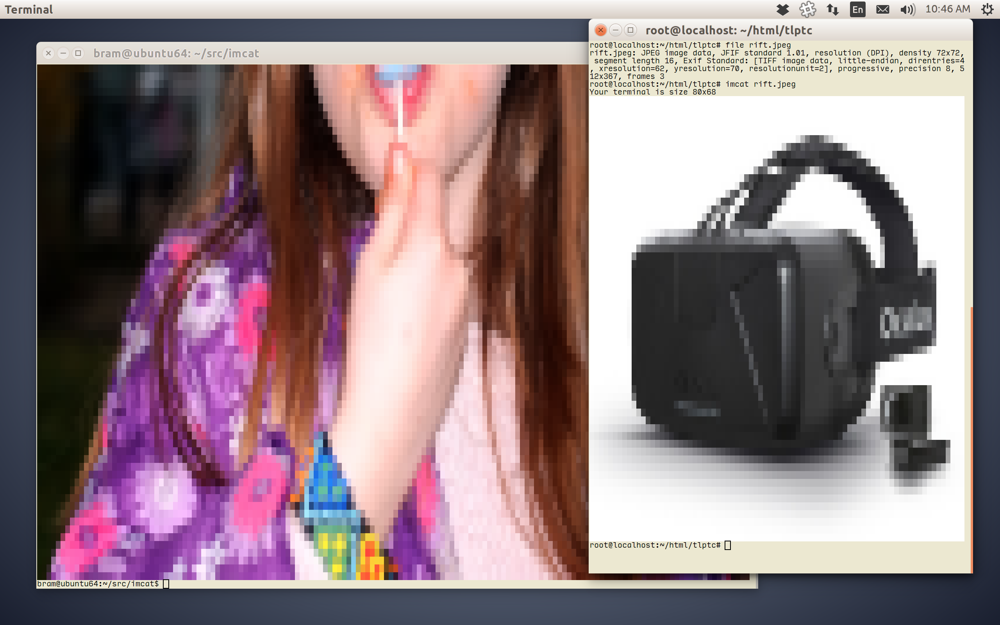

# imcat

Preview any size image in a terminal window. No X11 required.

## Introduction

Do you ever find yourself logged into a server, over SSH, but there is no X11 connection.
And you want to see the contents of an image?

imcat to the rescue!

imcat is a 24-bit image viewer that uses ANSI terminal colours to display any image supported by STB.
It automatically resizes to the width of your terminal, using proper sampling kernels.

## To do
* Correct for aspect ratio of terminal font.

## License

* Public Domain.

## Authors

[Bram Stolk](http://stolk.org).

[stb_image.h](http://nothings.org/stb_image.h) is by Sean Barrett et al.

